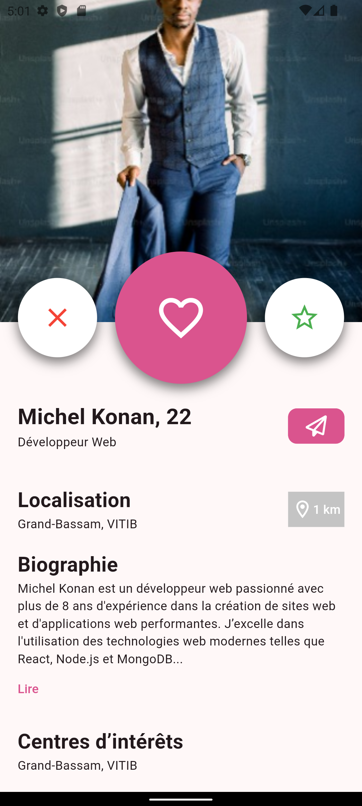
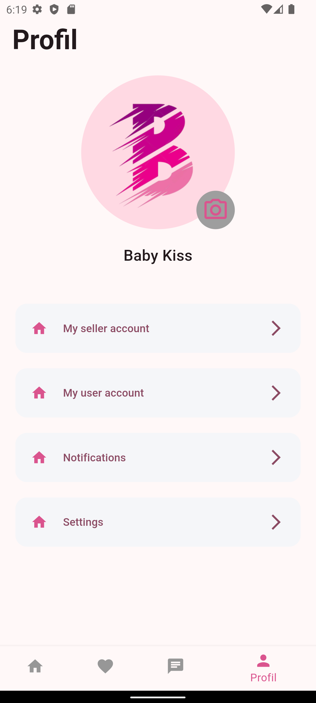

# Babikiss - Application de Rencontre

    

Babikiss est une application de rencontre innovante développée avec Flutter et Dart, permettant aux utilisateurs de se connecter et de rencontrer de nouvelles personnes. L'application offre une expérience utilisateur intuitive et fluide, avec des fonctionnalités avancées pour faciliter les rencontres.

## Aperçu de l'Application

  
  
  

